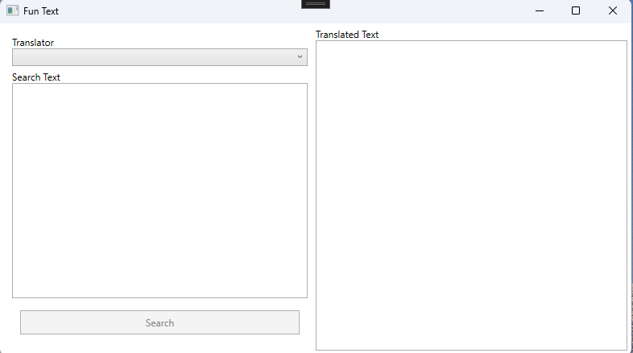
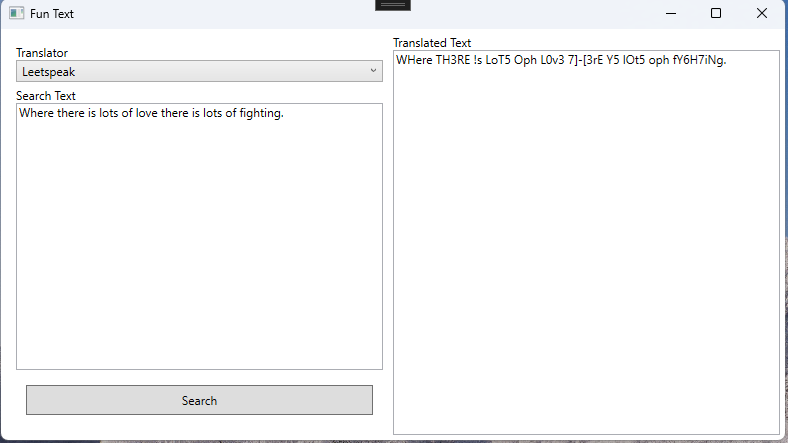

# Fun Text
Fun Text provieds a user-friendly interface for getting translations from FunTranslations.com: an online platform that offers a variety of playful translation tools.

## Technologies used
* C#
* .NET 9
* WPF
* HttpClient

## Using The App
1. Download the executable file fron the release section.
2. When the application launches, it should like this:

3. Type in the text you want to translate and and Hit Search:

## Upcoming Changes
* Adding more translators
* Adding data storage
* Enhance UI
